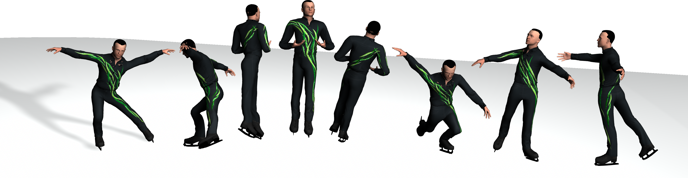

# Figure Skating Simulation from Video

Ri Yu, Hwangpil Park, and Jehee Lee (Pacific Graphics 2019)

Go to [Project Page](http://mrl.snu.ac.kr/research/ProjectSkate/skate.htm)

## Blog
http://mrl.snu.ac.kr/blog/ProjectSkate

## Requirements 

* Python 3 (tested on version 3.6)

* Dart

* Fltk

## Installation

**Dart**

    sudo apt install libeigen3-dev libassimp-dev libccd-dev libfcl-dev libboost-regex-dev libboost-system-dev libopenscenegraph-dev libnlopt-dev coinor-libipopt-dev libbullet-dev libode-dev liboctomap-dev libflann-dev libtinyxml2-dev liburdfdom-dev doxygen libxi-dev libxmu-dev liblz4-dev`
    git clone https://github.com/dartsim/dart.git
    cd dart
    mkdir build
    cd build
    cmake ..
    make -j4
    sudo make install
  

**Pydart**

    sudo apt install swig

after virtual environment(venv) activates,

    source venv/bin/activate
    git clone https://github.com/hpgit/pydart2.git
    cd pydart2
    pip install pyopengl==3.1.0 pyopengl-accelerate==3.1.0
    python setup.py build
    python setup.py install

**Fltk and Pyfltk**

    sudo apt install libfltk1.3-dev

Download [pyfltk](https://sourceforge.net/projects/pyfltk/files/latest/download)

    cd ~/Downloads
    tar xzf pyFltk[blabla].tar
    cd pyFltk[blabla]
    python setup.py build
    python setup.py install

**misc for skate**

    pip install pillow cvxopt scipy
    cd ~/PycharmProjects/skate/PyCommon/modules/GUI
    make -f GUI.makefile
    sudo apt install libgle3-dev

<!--
**How to install control**

    sudo apt-get install python3-tk
    pip install control

**How to install slycot**

    sudo apt-get install gfortran liblapack-dev
    pip install slycot -->
    
**Citation**

    @inproceedings{yu2019figure,
      title={Figure Skating Simulation from Video},
      author={Yu, Ri and Park, Hwangpil and Lee, Jehee},
      booktitle={Computer Graphics Forum},
      volume={38},
      number={7},
      pages={225--234},
      year={2019},
      organization={Wiley Online Library}
    }
    
